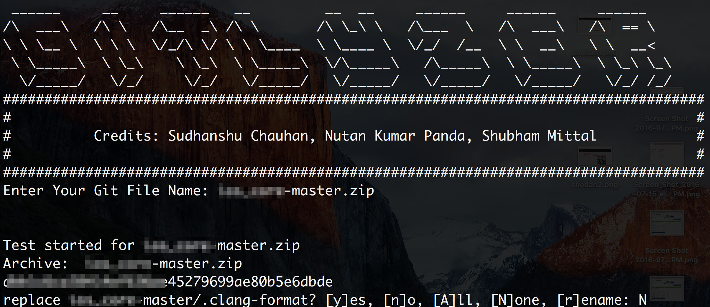

#Overview
* This is a simple script to search those super critical keywords that you want to search in your code i.e hardcoded credentials/API/PII etc.
* You can add the keywords you want to search based on projects to project and still able to automate the process.
* This can be tweaked for any kind of code tarting for mobile app/ web app/ simple scipts and even for complex frameworks.

#Pre-Requiusites
* Created with the love of python and just python 2.7 is enough for this.

#How to use Gitlizer

* Download Gitlizer.py
* Download your other git file that you wanted to test to the same place where your Gitlizer exist.
* Run Gitlizer.py using commandline. Then it will ask you to provide your Git file name.
* Just provide your Git file name. The full name such as git-master.zip.
*It will fetch all the codes which contains any sensitive keyword such as email, ip, username etc and put it in logfile.log where you can analyze all those.

#Roadmap
* Planned lots of stuff and will share soon.
